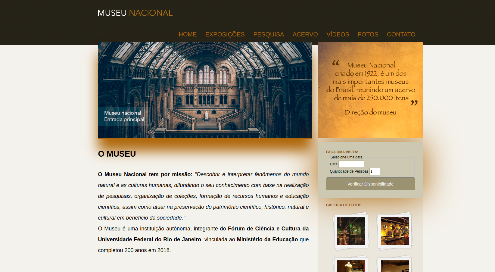

# Disciplina de Tópicos Especiais em Sistemas de Informação II

**Docente:** Ana Carolina Rodrigues

**Discente:** Tiago Mercês

Organizando a página, inseri o vídeo, mapa, descrição, estilizei o conteúdo e inseri o footer. 
______

GitHub Pages: 

[Acessem](https://tiagomerc.github.io/Museu-Nacional---Topicos-II-UFVJM/)

